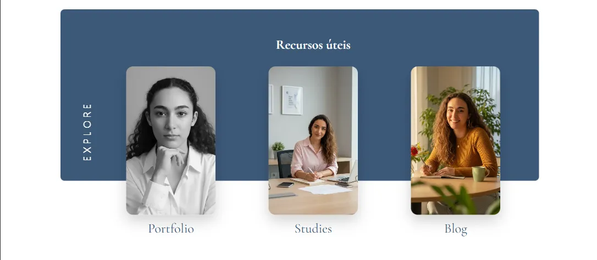
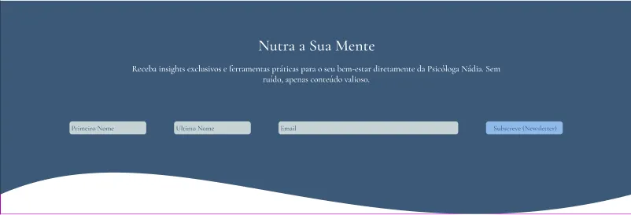
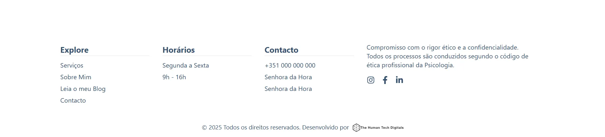
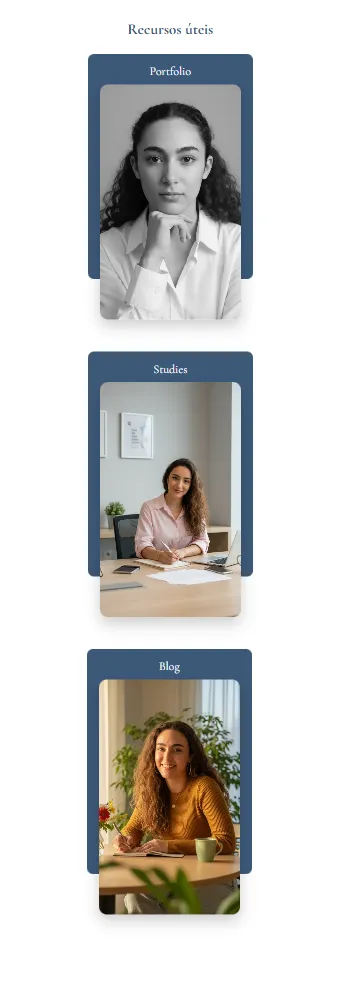
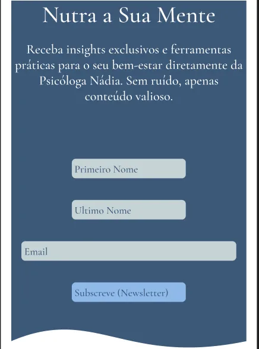
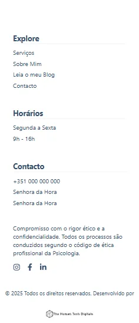

# Nadia Baptista Psychology Website

This repository contains the website for **Nadia Baptista**, a psychology student based in Porto. The project is part of a long term plan. It supports her student phase now and will grow into a full clinical website once she starts her practice.

The work follows a clear structure. Pages, components and styles are added in small steps to keep the code simple and easy to understand. The design aims to create trust with a calm, academic tone.

# Badges


  
  
  
  
  
  


---

# HomePage Preview

The HomePage is built in sections. Each part is responsive and follows a clean grid.

### Desktop Hero


This image shows the top section of the desktop layout. It includes the full width blue background layer and the logo placed on the grid container.

### Desktop Quick Links


This preview shows the three main links on desktop. Each card uses a Cloudinary image and follows the spacing tokens defined in `tokens.scss`.

### Desktop Newsletter Banner


This section shows the soft wave background and the text centered in a simple one column layout.

### Desktop Footer


This screenshot shows the footer on desktop with the logo, links and social items aligned on the grid.

---

# Mobile Experience

The mobile version uses a two step flow. First the Landing screen, then the Home screen. The logic uses only in memory state. No persistence is used.

### Mobile Landing


This image shows the first mobile screen. It has the logo, portrait and a short introduction needed for SEO.

### Mobile Quick Links


This preview shows the link cards adapted to a single column mobile grid.

### Mobile Newsletter Banner


This image shows the wave background scaled for small screens.

### Mobile Footer


This screenshot shows the footer stacked in a simple vertical layout.

---

# Tech Stack

### Frontend and Backend
- Next.js App Router
- React Server Components and Client Components
- TypeScript
- SCSS with a three level BEM structure

### Deployment
- Hosted on Vercel
- DNS managed on Hostinger

### Media
- All images stored on Cloudinary
- No local file storage

### Content
- Blog uses mock data during the first phase
- Future plan includes Prisma and PostgreSQL

### Email
- Contact form uses a Route Handler
- Email is sent from the server through an external provider

### SEO
- Each page uses `generateMetadata`
- Page slugs for blog posts
- Future multilingual support
- Sitemap and robots files planned

---

# Project Goals

## Phase 1
Student website
- Full HomePage
- Mobile entry flow
- Studies page
- Portfolio page
- Blog with mock posts
- Contact page
- Cloudinary setup
- Clean and calm identity

## Phase 2
Early pre clinical presence
- Expanded About page
- Base content for Services
- FAQ structure

## Phase 3
Clinical practice
- Activate Services and FAQ
- Appointment system
- Full blog with database
- Local SEO for Porto
- Admin panel

---

# Design System

## Typography
- Headings use Cormorant Garamond
- Body text uses Inter
- Tokens stored in `tokens.scss`

## Colors
- Primary blue: #3C5979
- Light blue: #C5D3D6
- Secondary blue: #8FBAEA
- White: #FFFFFF
- Text near black

## Grid
- Desktop: 12 column centered grid
- Mobile: 4 column layout

## Spacing tokens
`--spaceXs`, `--spaceSm`, `--spaceMd`, `--spaceLg`, `--spaceXl`

---

# Mobile Flow

The mobile flow has two screens. The first shows the intro content and the second loads the HomePage. All logic uses simple in memory state.


---

# Current File Structure

```
src/
  app/
    layout.tsx
    page.tsx

    about/
      page.tsx

    studies/
      page.tsx

    portfolio/
      page.tsx

    services/
      page.tsx

    faq/
      page.tsx

    contact/
      page.tsx

    blog/
      page.tsx
      [slug]/
        page.tsx

    admin/
      layout.tsx
      blog/
        new/
          page.tsx
        [id]/
          edit/
            page.tsx

    api/
      contact/
        route.ts
      upload/
        route.ts

  components/
    layout/
      Header.tsx
      Footer.tsx
      MainLayout.tsx

    home/
      HomeEntry.tsx
      HomeDesktop.tsx
      HomeMobile.tsx
      LandingMobile.tsx
      HomeHero.tsx
      HomeHowICanHelp.tsx
      HomeQuickLinks.tsx
      HomeAboutHighlight.tsx
      HomeNewsletterBanner.tsx

    blog/
      BlogCard.tsx
      BlogList.tsx

    form/
      TextInput.tsx
      Textarea.tsx
      FileUpload.tsx

  styles/
    globals.scss
    tokens.scss
    components/
      _buttons.scss
      _layout.scss
      _forms.scss
      _home.scss

  lib/
    email/
      sendContactEmail.ts
    cloudinary/
      cloudinaryServer.ts
    blog/
      mockPosts.ts

  types/
    blog.ts
    contact.ts
```

---

# Development Principles

- Small and clear steps
- One commit per feature
- Simple code
- No local media
- Architecture planned for future growth

---

# Scripts

```
npm install
npm run dev
npm run build
npm start
```

---

# Cloudinary Setup

```
CLOUDINARY_CLOUD_NAME=
CLOUDINARY_API_KEY=
CLOUDINARY_API_SECRET=
```

---

# Contact Form

Location  
`src/app/api/contact/route.ts`

---

# Future Work

- Content for HomePage
- Studies and Portfolio pages
- Multilingual version
- Appointment system
- Admin panel
- Activate Services and FAQ
- SEO for Porto

---


## 🤝 About the Creator

This project is part of my professional front-end developer portfolio, demonstrating attention to detail, clean code structure and modern UI development techniques.

---

## 📩 Contact

Email: mailto:contact@deolindobaptista.com

LinkedIn: https://www.linkedin.com/in/deolindobaptista/

GitHub: https://github.com/Deobap73

---

### ⭐ If you find this project useful, consider giving it a star!
